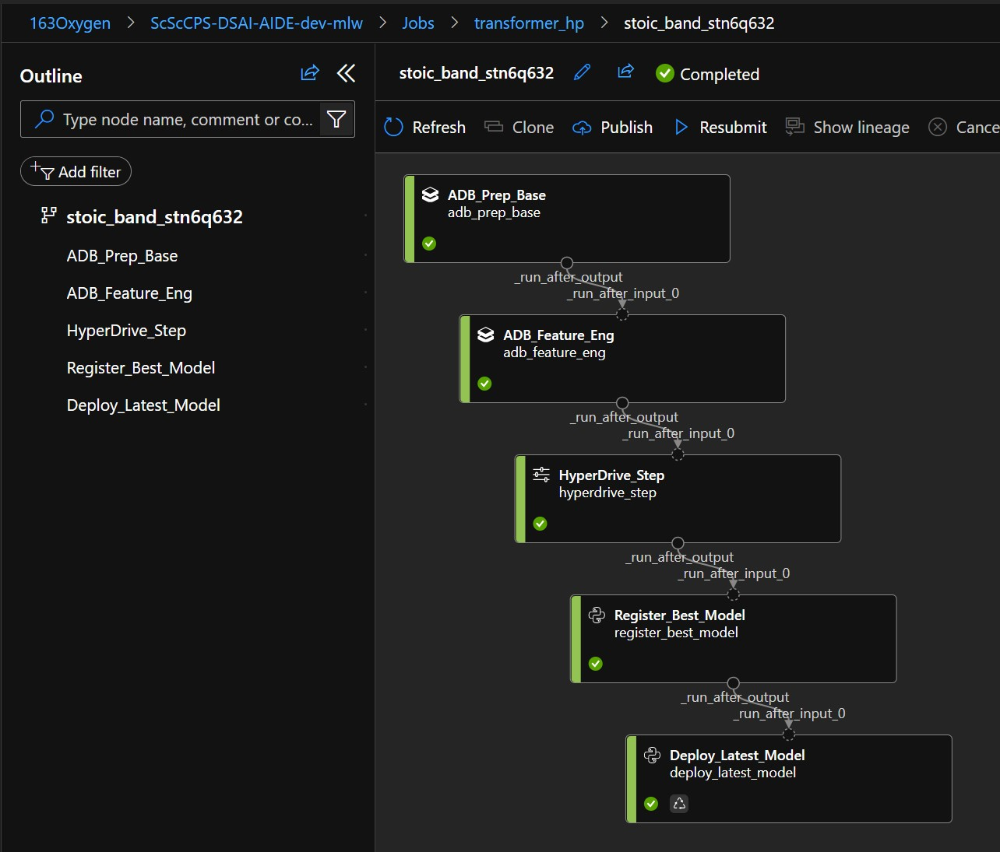
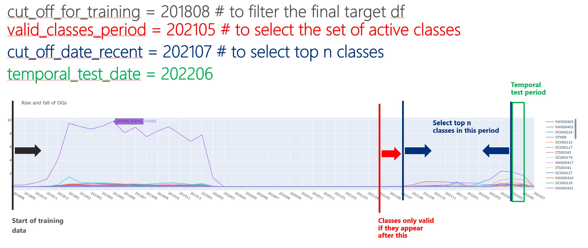
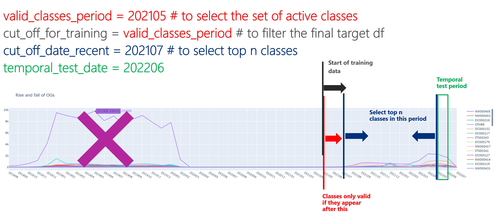
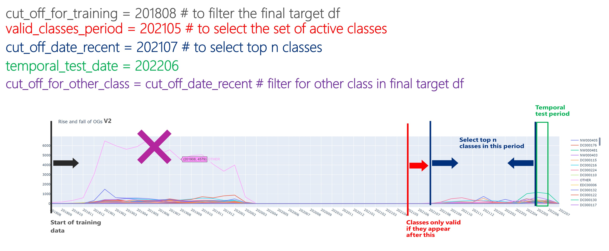

# ECD Ticker Classification
## Collaboration on ECD ticket classifier

This work is completed with a collaboration between `Microsoft Horizon AI` program and `Shared Services Canada`. The intention was to build classifier to predict the Owner Group assignment of ECD tickets.

This work leverages two platforms; AML and Databricks and orchestrates the pipeline through [AML Pipelines V1](https://learn.microsoft.com/en-us/python/api/overview/azure/ml/?view=azure-ml-py&preserve-view=true). The model is trained using [Bert Based Cased](https://huggingface.co/tftransformers/bert-base-cased) and is deployed in [Managed Endpoints using SDKV2](https://learn.microsoft.com/en-us/azure/machine-learning/how-to-deploy-managed-online-endpoints). In order to run the pipeline, you need to run the [DefinePipeline.ipynb](./DefinePipeline.ipynb) notebook.

## Step 1 - ADB_Prep_Base

This is a short step that cleans the raw data. In this step, the raw data is picked up and cleaned, deduplicated, and prepared to be used in the next step.

## Step 2 - ADB_Feature_Eng

This step picks up the cleaned dataset, and allows the data scientists to enforce how the training and test datasets are prepared by providing the arguments. First, it read the `top_n` parameter to select the top n frequent Owner Groups (OG) and identify the rest of OGs as `Other` class. The current value is set as 120 top classes + the Other class. Several heuristics are applied to the data which were observed during EDA and the final datasets are prepared based on three logics which are V2, V3 and V4.

* cut_off_for_training (201808) => the cut-off date for the training data
* valid_classes_period (202105) => this is the cut-off date to select valid classes. Any class appeared after this date is considered valid and the records that have no representation from this date is removed from the training set as it's not considered valid class.
* cut_off_date_recent (202107) => the period to select the top n frequent classes. This is consider only recent period to select the frequent classes so the OGs that were frequent before this date becomes less important and fall into the OTHER class.
* temporal_test_date (202206) => this is to leave out a whole month (most recent) to observe how the model performs on a totally unseen period which is temporally dependant.

### Logic Concept
**V2**: Image below shows how the values are set and the final graph:

**V3**: Unlike V2, in V3, `cut_off_for_training` are `valid_classes_period` equal:

**V4**: This logic is similar to V2 except only for the Other group, it cuts all records prior to `valid_classes_period`:

Finally, the data is registered as AML Datasets under:

- `owner_g_classfication_train` -> 80% of dataset used for training
- `owner_g_classfication_val` -> 10% of dataset used for validation
- `owner_g_classfication_test` -> 10% of dataset used for test
- `owner_g_classfication_temporal_test`  -> a whole month which is the most recent to test the model on unseen records

## Step 3 - HyperDrive_Step

This step is a [HyperDrive](https://learn.microsoft.com/en-us/python/api/azureml-pipeline-steps/azureml.pipeline.steps.hyperdrivestep?view=azure-ml-py) step which tunes a [HuggingFace Transformer Bert Base Cased](https://huggingface.co/tftransformers/bert-base-cased). The parameters of the step can help increasing the trials and test different combinations of hyperparameters to get to the best model.

The most important parameters are `learning-rate` and `epochs`. During tests, we learned that `learning-rate` 5.5e-5 can generalize the unseen temporal test set better than other values. The `epoch` value is recommended to be set to 3 or 4 based on the Bert paper.

## Step 4 - Register_Best_Model

In this step, the aim is to find the best model to register based on the previous runs. The most important parameters are `metric-name` and `temporal-test-date` which focuses on the runs that have similar `temporal-test-date` and compares the `metric-name` among the trials. This is to make sure the models are compared equally.

The logic behind this step is simple, I suggest you add more tests before deploying the new model.

## Step 5 - Deploy_Latest_Model

In this step, the recently registered model is deployed as an `AML Managed Endpoint`. The logics deploys a new `deployment` with the newly registered model and if a simple test is passed, the traffic is increased to 100% and other deployments are deleted.

## Rooms for improvement

1- **Leveraging larger models**: `Bert-base-cased` is considered a moderate sized model. Leveraging larger language models theoretically should improve the model performance. Models such as `Bert-Large`, `DeBerta`, `DeBerta-Large`, etc.

2- **Resolving the Owner Group drift issue**: There is a known issue with changing the Owner Group assignment rules every year in April. This needs to be tracked so the model doesn't get impacted by the OG changes. If this is not tracked, every year, we should expect a drop in performance for April that slowly improves in the next coming months as new data is introduced.

