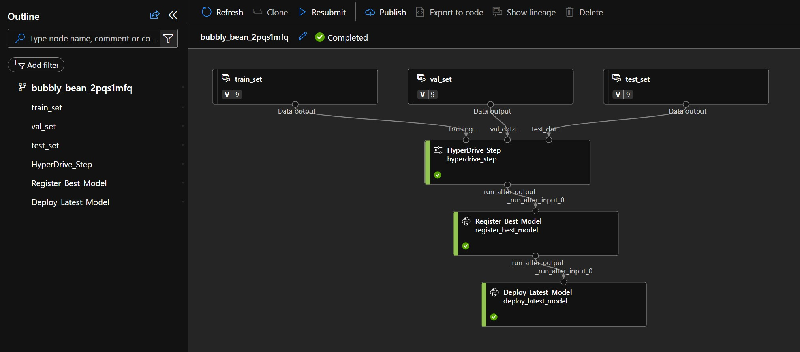
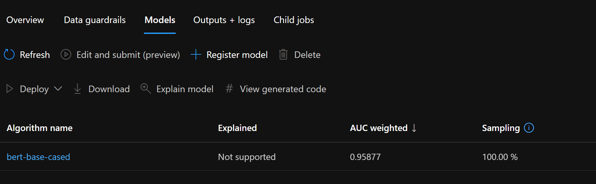

# Accelerator - Fine-Tuning Language Models in AML with Custom Datasets

# Repository Overview

This repository contains three Jupyter notebooks that demonstrate end-to-end an NLP pipeline using AzureML v1, AzureML v2, and AzureML v1 with AutoML and Transformers, respectively. All notebooks use HyperDrive for hyperparameter tuning, Managed Online Endpoint for model training and deployment, and Amazon product reviews in the Automotive category as the dataset.

The aim is to provide an example to fine-tune a custom NLP model using native AML capabilities including HyperDrive to tune the hyperparameters, AutoML job to compare results and Managed Endpoint to deploy the model. This version is developed using AML V1 although the deployment of the model to Managed Endpoints is developed using SDK V2.

This work leverages [AML Pipelines V1](https://learn.microsoft.com/en-us/python/api/overview/azure/ml/?view=azure-ml-py&preserve-view=true), [AML Pipelines V2](https://learn.microsoft.com/en-us/azure/machine-learning/tutorial-pipeline-python-sdk?view=azureml-api-2), [AutoML](https://learn.microsoft.com/en-us/azure/machine-learning/concept-automated-ml?view=azureml-api-2) and [Managed Endpoints](https://learn.microsoft.com/en-us/azure/machine-learning/how-to-deploy-managed-online-endpoints). You can bring in several model types, but for this example, we used [Bert Based Cased](https://huggingface.co/tftransformers/bert-base-cased).

## Table of Contents
- [Notebook 1: AzureML v1 and Transformers](./hyperparameter_sweep_v1.ipynb)
- [Notebook 2: AzureML v2 and Transformers](./hyperparameter_sweep_v2.ipynb)
- [Notebook 3: AzureML v1, AutoML, and Transformers](./hyperparameter_sweep_and_automl_pipeline_v1.ipynb)

## Notebook 1: AzureML v1 and Transformers

This notebook demonstrates an end-to-end text classification (sentiment analysis) process using AzureML v1 and Transformers. The process includes:

- Setting up the necessary AzureML workspace and compute resources
- Configuring the environment
- Downloading and parsing data from a URL to a Pandas DataFrame
- Splitting the data into train, validation, and test sets
- Registering the datasets in the AzureML workspace
- Creating a pipeline with a HyperDriveStep for hyperparameter tuning and several PythonScriptSteps for testing, registering, and deploying the best model as a web service



## Notebook 2: AzureML v2 and Transformers

This notebook represents the end-to-end process of training, tuning, registering, and deploying a sentiment analysis model using AzureML SDK v2 and Transformers. The steps executed in this pipeline are similar to those in Notebook 1 but make use of the newer AzureML SDK v2.

Todo: Pipeline image v2


## Notebook 3: AzureML v1, AutoML, and Transformers

This notebook demonstrates an end-to-end machine learning process using AzureML v1, AutoML, and Transformers. The process includes:

- Setting up the necessary AzureML workspace and compute resources
- Configuring the environment
- Downloading and parsing data from a URL to a Pandas DataFrame
- Splitting the data into train, validation, and test sets
- Registering the datasets in the AzureML workspace
- Creating a pipeline with a HyperDriveStep for hyperparameter tuning, an AutoMLStep for model selection, and several PythonScriptSteps for testing, registering, and deploying the best model as a web service
- Utilizing AzureML's HyperDrive for hyperparameter tuning with random parameter sampling and a BanditPolicy for early termination
- Leveraging AzureML's AutoML to automatically select the best model based on the specified primary metric, taking advantage of the platform's built-in algorithms and feature engineering capabilities

This notebook provides a comprehensive example of using AzureML to automate the machine learning process, from data preparation to model deployment. It showcases the powerful capabilities of the platform, such as HyperDrive for hyperparameter tuning and AutoML for model selection, and enables seamless integration of various pipeline steps.


## Requirements
* **Dataset** - Amazon Dataset is used - the details are explained below.
* **AML Workspace** - This work is optimized for Azure Machine Learning, therefore you need to have an active Azure Subscription (free subscription works as well) and an Azure Machine Learning Workspace.
* **AML Computes** - The training requires compute with enabled System-Assigned Managed Identity:
    - a GPU based compute. [NC6_V3](https://learn.microsoft.com/en-us/azure/virtual-machines/ncv3-series) based on [NVidia Tesla V100](https://www.nvidia.com/en-gb/data-center/tesla-v100/) series yeild good results but you can gain considerable seedup by using `STANDARD_NC24ADS_A100_V4` series, instead.
    - After the training step, a CPU based [AML Cluster](https://learn.microsoft.com/en-us/azure/machine-learning/v1/how-to-create-attach-compute-cluster?tabs=python#what-is-a-compute-cluster) could be used for registration and deployment steps.
* **RBAC Roles** - Grant to Compute's System Assigned Managed identity access to
     - `Storage Blob Owner` - Workspace storage account scope
     - `Azure ML Datascientist` - Workspace scope (for Pipeline creating Managed Endpoints)
* **Managed Endpoint** - Created by lst step in pipeline. The model is deployed as an online [Managed Endpoint](https://learn.microsoft.com/en-us/azure/machine-learning/how-to-deploy-managed-online-endpoints?tabs=azure-cli) to serve incoming requests.

## Dataset
The dataset is the Amazon Review dataset from [UCSD](http://jmcauley.ucsd.edu/data/amazon/) archive to predict sentiment of the reviews from ratings. For this sample, the Automotive dataset is chosen which has around 19K samples. [DefinePipeline.ipynb](./DefinePipeline.ipynb) notebook contains the steps to download and prepare the dataset.

## AML Pipeline
This work is using AML Pipelines for easier operationalization of the workload. It consists of five steps which includes 
- HyperDrive Step to hyper tune and train the model
- AutoML Step to find best model 
- Test AutoML Model step (required at the moment as text xlassification AutoML job does not support testing model at this time)
- Model Registration step to compare the test metrics for both models found by Hyperdrive and AutoML steps and add the best model into the model repository
-  Model Deployment step to deploy the model as an online Managed Endpoint.

## Step 1 - HyperDrive_Step

This step is a [HyperDrive](https://learn.microsoft.com/en-us/python/api/azureml-pipeline-steps/azureml.pipeline.steps.hyperdrivestep?view=azure-ml-py) step which tunes a [HuggingFace Transformer Bert Base Cased](https://huggingface.co/tftransformers/bert-base-cased). The parameters of the step can help increasing the trials and test different combinations of hyperparameters to get to the best model.

The most important parameters are `learning-rate` and `epochs`. During tests, we learned that `learning-rate` 5.5e-5 can on this dataset. The `epoch` value is recommended to be set to 3 or 4 based on the Bert paper.


### GPU Resource Utilization Tracking with Nvitop

In this step, we utilized the [nvitop](https://github.com/XuehaiPan/nvitop) Python package to monitor and collect GPU resource utilization during the fine-tuning of the Transformers. `Nvitop` is a powerful tool designed for NVIDIA GPUs that provides real-time visualizations of GPU usage and statistics, similar to what `htop` provides for CPUs. By using `nvitop`, we were able to track GPU metrics such as GPU temperature, GPU utilization, memory utilization, and more. This allowed us to ensure that the training process was efficiently using the available resources, and to identify potential bottlenecks or issues in real-time. Understanding these metrics is key to optimizing the fine-tuning process and ensuring that the model training is both effective and efficient.

Here's an example of how to use the `nvitop` package to monitor your GPU utilization:

```python
from nvitop import ResourceMetricCollector
....
....

if collect_resource_utilization == 1:
        collector = ResourceMetricCollector(interval=resource_utilization_interval)
        daemon = collector.daemonize(on_collect, interval=None, tag="")

def on_collect(metrics):
    .....
    if run:
        run.log_row(f"{gpu_name} utilization", **perc_vals)
        run.log_row(f"{gpu_name} memory", **mem_vals)
    .....
```

## Step 2 - AutoML Step (Only in [Notebook 3: AzureML v1, AutoML, and Transformers](./hyperparameter_sweep_and_automl_pipeline_v1.ipynb))
This step is running [AutoML](https://learn.microsoft.com/en-us/azure/machine-learning/v1/how-to-use-automlstep-in-pipelines) job on the training and validation datasets. Based on example in:
[automl-nlp-text.ipynb](https://github.com/Azure/azureml-examples/blob/main/sdk/python/jobs/automl-standalone-jobs/automl-nlp-text-named-entity-recognition-task-distributed-sweeping/automl-nlp-text-ner-task-distributed-with-sweeping.ipynb)

Based on the evaluation metric set (in our case `AUC_weighted` as `f1_weighted` is not supported for nlp tasks) the best model found is the output of the job:


## Step 3 - Test_AutoML_Model (Only in [Notebook 3: AzureML v1, AutoML, and Transformers](./hyperparameter_sweep_and_automl_pipeline_v1.ipynb))

In this step, the best model found by AutoML is tested to calculate  `AUC_weighted` metrics on the test dataset and compare to Hyperdrive run.


## Step 4 - Register_Best_Model

In this step, the aim is to find the best model to register based on the previous HyperDrive and AutoML runs. This step focuses on the historical runs and picks up the highest performing runs based on the `metric-name` parameter.

## Step 5 - Deploy_Latest_Model

In this step, the recently registered model is deployed as an `AML Managed Endpoint`. The logics deploys a new `deployment` with the newly registered model and if a simple test is passed, the traffic is increased to 100% and other deployments are deleted.

`Todo: Add a snapshot of the Managed Endpoint`
