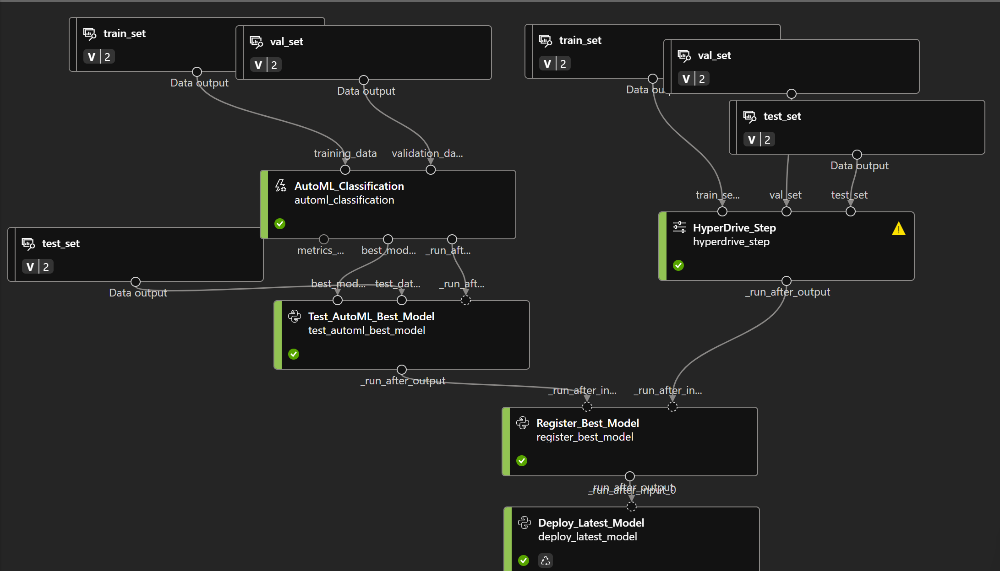

# Accelerator - Fine-Tuning Language Model in AML with Custom Dataset

To be added:
- We add a table of content that describes what is included
- The fact that we have multiple scenarios
- Fixing the file paths and names
- 

This work is aimed to provide an example to fine-tune a custom NLP model using native AML capabilities including HyperDrive to tune the hyperparameters, AutoML job to compare results and Managed Endpoint to deploy the model. This version is developed using AML V1 although the deployment of the model to Managed Endpoints is developed using SDK V2.

This work leverages [AML Pipelines V1](https://learn.microsoft.com/en-us/python/api/overview/azure/ml/?view=azure-ml-py&preserve-view=true). The model is trained using several models including [Bert Based Cased](https://huggingface.co/tftransformers/bert-base-cased) and is deployed in [Managed Endpoints using SDKV2](https://learn.microsoft.com/en-us/azure/machine-learning/how-to-deploy-managed-online-endpoints). In order to run the pipeline, you need to run the [DefinePipeline.ipynb](./DefinePipeline.ipynb) notebook.

## Requirements
* **Dataset** - Amazon Dataset is used - the details are explained below.
* **AML Workspace** - This work is optimized for Azure Machine Learning, therefore you need to have an active Azure Subscription (free subscription works as well) and an Azure Machine Learning Workspace.
* **AML Computes** - The training requires compute with enabled System-Assigned Managed Identity:
    - a GPU based compute. Ideally, an [NC6_V3](https://learn.microsoft.com/en-us/azure/virtual-machines/ncv3-series) which contains an [NVidia Tesla V100](https://www.nvidia.com/en-gb/data-center/tesla-v100/).  Running on `STANDARD_NC24ADS_A100_V4` speeds up training by 50% comparing to `STANDARD_NC6`
    - After the training step, a CPU based [AML Cluster](https://learn.microsoft.com/en-us/azure/machine-learning/v1/how-to-create-attach-compute-cluster?tabs=python#what-is-a-compute-cluster) could be used for registration and deployment steps.
* **RBAC Roles** - Grant to Compute's System Assigned Managed identity access to
     - `Storage Blob Owner` - Workspace storage account scope
     - `Azure ML Datascientist` - Workspace scope (for Pipeline creating Managed Endpoints)
* **Managed Endpoint** - Created by lst step in pipeline. The model is deployed as an online [Managed Endpoint](https://learn.microsoft.com/en-us/azure/machine-learning/how-to-deploy-managed-online-endpoints?tabs=azure-cli) to serve incoming requests.

## Dataset
The dataset is the Amazon Review dataset from [UCSD](http://jmcauley.ucsd.edu/data/amazon/) archive to predict sentiment of the reviews from ratings. For this sample, the Automotive dataset is chosen which has around 19K samples. [DefinePipeline.ipynb](./DefinePipeline.ipynb) notebook contains the steps to download and prepare the dataset.

## AML Pipeline
This work is using AML Pipelines for easier operationalization of the workload. It consists of five steps which includes 
- HyperDrive Step to hyper tune and train the model
- AutoML Step to find best model 
- Test AutoML Model step (required at the moment as text xlassification AutoML job does not support testing model at this time)
- Model Registration step to compare the test metrics for both models found by Hyperdrive and AutoML steps and add the best model into the model repository
-  Model Deployment step to deploy the model as an online Managed Endpoint.

## Step 1 - HyperDrive_Step

This step is a [HyperDrive](https://learn.microsoft.com/en-us/python/api/azureml-pipeline-steps/azureml.pipeline.steps.hyperdrivestep?view=azure-ml-py) step which tunes a [HuggingFace Transformer Bert Base Cased](https://huggingface.co/tftransformers/bert-base-cased). The parameters of the step can help increasing the trials and test different combinations of hyperparameters to get to the best model.

The most important parameters are `learning-rate` and `epochs`. During tests, we learned that `learning-rate` 5.5e-5 can on this dataset. The `epoch` value is recommended to be set to 3 or 4 based on the Bert paper.

## Step 2 - AutoML Step
This step is running [AutoML](https://learn.microsoft.com/en-us/azure/machine-learning/v1/how-to-use-automlstep-in-pipelines) job on the training and validation datasets. Based on example in:
[automl-nlp-text.ipynb](https://github.com/Azure/azureml-examples/blob/main/sdk/python/jobs/automl-standalone-jobs/automl-nlp-text-named-entity-recognition-task-distributed-sweeping/automl-nlp-text-ner-task-distributed-with-sweeping.ipynb)

Based on the evaluation metric set (in our case `AUC_weighted` as `f1_weighted` is not supported for nlp tasks) the best model found is the output of the job:

## Step 3 - Test_AutoML_Model

In this step, the best model found by AutoML is tested to calculate  `AUC_weighted` metrics on the test dataset and compare to Hyperdrive run.

## Step 4 - Register_Best_Model

In this step, the aim is to find the best model to register based on the previous HyperDrive and AutoML runs. This step focuses on the historical runs and picks up the highest performing runs based on the `metric-name` parameter.

## Step 5 - Deploy_Latest_Model

In this step, the recently registered model is deployed as an `AML Managed Endpoint`. The logics deploys a new `deployment` with the newly registered model and if a simple test is passed, the traffic is increased to 100% and other deployments are deleted.

## Rooms for improvement

1- **Leverage larger models**: `Bert-base-cased` is considered a moderate sized model. Leveraging larger language models theoretically should improve the model performance. Models such as `Bert-Large`, `DeBerta`, `DeBerta-Large`, etc.

2- **Add more rigid tests in the model registry step**: currently, every new model is compared only by the statistical tests generated during the training. There could be more tests to make sure that the model is trustable before registering and deploying the model.

3- **Add the Telemetries in App Insights**: currently the online model doesn't record any telemetries to App Insights. In the future, we will this functionality.

